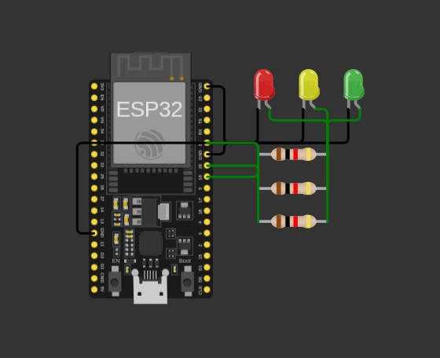

# Belajar IoT ESP32

Kumpulan proyek latihan IoT menggunakan ESP32 dan Wokwi Simulator.

## Daftar Proyek
- [01-esp32-blink](./01-esp32-blink) - Latihan dasar Blink 1 LED
- [02-esp32-traffic-light](./02-esp32-traffic-light) - Simulasi Lampu Lalu Lintas 3 Warna

